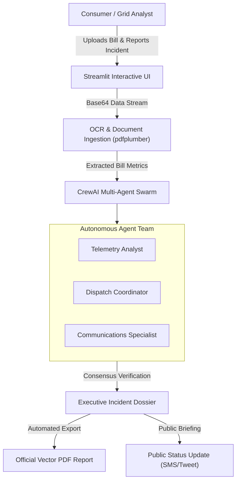

# ⚡ GridGuard AI — Autonomous Grid Telemetry & Tariff Dispute Platform

> **Autonomous multi-agent intelligence platform that audits utility bills, correlates outage telemetry with SCADA breaker logs, and resolves electricity billing spikes and tariff disputes.**

---

## 🌟 Overview

**GridGuard AI** is an enterprise-grade agentic AI platform designed for electricity consumers and grid operators. Built for the **Aspire Agentic AI Hackathon**, it combines **CrewAI** multi-agent swarms with **OCR document ingestion** and real-time SCADA telemetry correlation to protect consumers from overbilling, unannounced outages, and power surge anomalies.

---

## 🚀 Key Features

- **📑 Multi-Pass OCR Document Ingestion**:
  - Automatically parses electronic and scanned electricity bills (PDF, TXT, CSV, images) using `pdfplumber` and `pypdf`.
  - Extracts exact consumption units (kWh), peak/off-peak slabs, fuel price adjustments (FPA), financing surcharges, and meter register dates.
- **🇵🇰 Regional Distribution Utility (DISCO) Integration**:
  - Full support for Pakistani distribution companies: **IESCO** (Islamabad/Rawalpindi), **LESCO** (Lahore), **K-Electric** (Karachi), **PESCO** (Peshawar), **FESCO** (Faisalabad), **MEPCO** (Multan), and **QESCO** (Quetta).
  - Correlates cases against **NEPRA Consumer Service Regulations (S.R.O. 124)** for outage compensation and tariff caps.
- **⚡ Live 5-Step Multi-Agent Swarm Pipeline**:
  - Real-time animated consensus tracking across specialized agents:
    1. **Bill Auditor (Tariff Specialist)** — Verifies rate brackets, billing math, and statutory levies.
    2. **Outage Investigator (Grid Telemetry)** — Cross-references neighborhood flicker reports with substation breaker logs.
    3. **Environment Analyst (Weather Correlator)** — Correlates temperature and severe storm events with blackout timestamps.
    4. **Evidence Critic (Discrepancy Examiner)** — Audits inductive backfeed spikes and phantom meter surge readings.
    5. **Report Generator (Dispute Brief)** — Synthesizes executive briefings and regulatory refund dossiers.
- **📄 Vector PDF Intelligence Report Generation**:
  - Generates official, publication-quality `report.pdf` dispute dossiers with cryptographic electronic verification hashes, executive summaries, dispatch checklists, and regulatory citations using ReportLab.
- **🔄 Universal LLM Backend Support**:
  - Supports high-speed inference via **Groq** (`openai/gpt-oss-20b`, `llama-3.3-70b-versatile`) and **Google Gemini** (`gemini-3.8-flash`).
  - Seamless in-browser API key persistence and configuration.

---

## 🏗️ Architecture



---

## 🛠️ Tech Stack

- **Core Framework**: [Streamlit](https://streamlit.io/)
- **Multi-Agent Orchestration**: [CrewAI](https://www.crewai.com/)
- **LLM Inference**: [Groq Cloud](https://console.groq.com/) & [Google Gemini](https://ai.google.dev/)
- **Document OCR & Extraction**: `pdfplumber`, `pypdf`, `Pillow`
- **PDF Report Generation**: `ReportLab`
- **Frontend & Styling**: Tailwind CSS, Google Material Symbols, Inter Typography

---

## ⚡ Quick Start

### 1. Clone the Repository
```bash
git clone https://github.com/legendSirUmer/GridGuardAI.git
cd GridGuardAI
```

### 2. Create and Activate Virtual Environment
```bash
python -m venv env
# On Windows:
.\env\Scripts\activate
# On Linux/macOS:
source env/bin/activate
```

### 3. Install Dependencies
```bash
pip install -r requirements.txt
```

### 4. Configure API Keys
Create a `.env` file in the root directory (or enter your key directly in the in-app Settings modal):
```env
GROQ_API_KEY=your_groq_api_key_here
# Or:
GEMINI_API_KEY=your_gemini_api_key_here
```

### 5. Launch the Platform
```bash
streamlit run app.py
```
Open your browser at `http://localhost:8501` (or `http://localhost:8502`).

---

## 📜 License

MIT License. Developed for the Aspire Agentic AI Hackathon.
